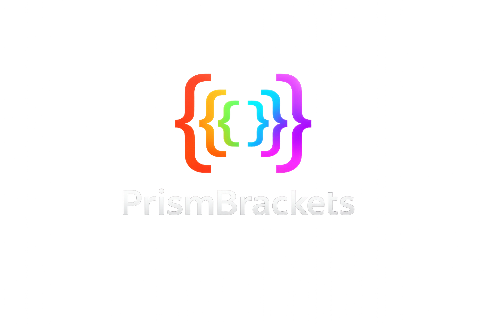
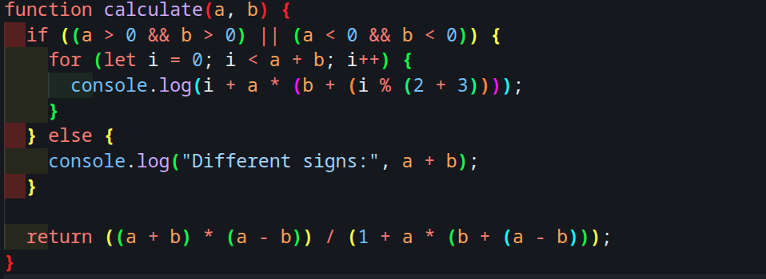
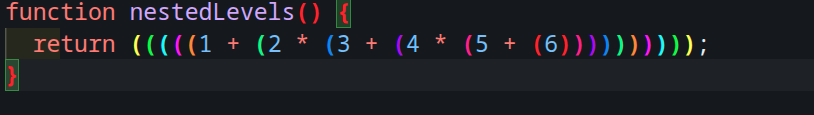
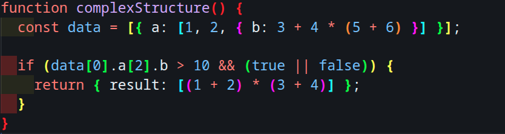

<p align="center">
  
</p>

<h1 align="center">PrismBrackets</h1>

<p align="center">
  🌈 Depth-based rainbow bracket highlighting with glow and matching bracket detection for Visual Studio Code.
</p>

<p align="center">
  Clean • Fast • Visual
</p>

<p align="center">
  
  
  
</p>

---

## 🚀 Overview

PrismBrackets enhances your coding experience by applying **colorful, depth-based highlighting** to brackets, combined with a subtle glow and real-time matching.

It helps you:

* Understand deeply nested code instantly
* Reduce visual confusion
* Improve focus and readability

---

## ✨ Features

### 🌈 Rainbow Bracket Highlighting

* Unique color for each nesting level
* Smooth cycling for deep nesting
* Supports `()`, `{}`, `[]`

---

### ✨ Glow Effect

* Soft glow around brackets
* Optimized for dark themes
* Enhances visibility without distraction

---

### 🎯 Matching Bracket Highlight

* Highlights matching pair under cursor
* Strong glow + border effect
* Works instantly while navigating

---

### 📌 Status Bar Indicator

* Displays `PrismBrackets` in status bar
* Confirms extension is active

---

### ⚡ Real-time Updates

* Updates instantly while typing
* No reload required

---

## 🖼️ Preview

### 🔥 Main Showcase

<p align="center">
  
</p>

---

### 🌈 Nested Depth Highlight

<p align="center">
  
</p>

---

### 🧠 Mixed Brackets (Real Code)

<p align="center">
  
</p>

---

## 🧪 Example

```js
function example() {
  return (1 + (2 * (3 + (4 * (5 + (6))))));
}
```

---

## 📦 Installation

### From VSIX

```bash
code --install-extension prismbrackets.vsix
```

---

## 🛠 Development

```bash
npm install
npm run watch
```

Press `F5` to run the extension.

---

## 📄 License

This project is licensed under the **MIT License**.

---

<p align="center">
  Built for developers who love clean code ✨
</p>
